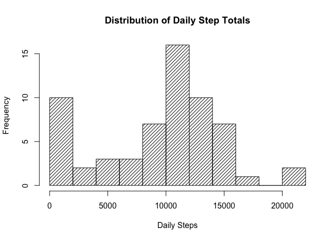
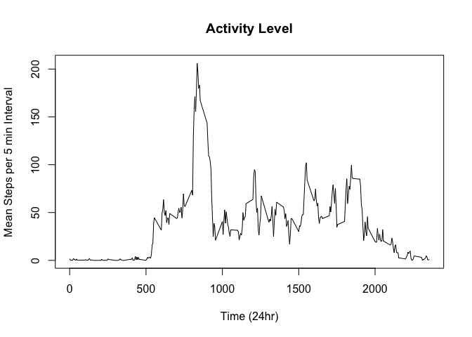
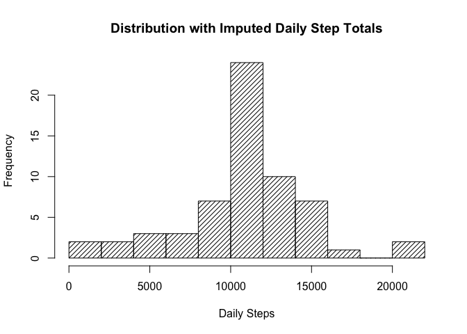
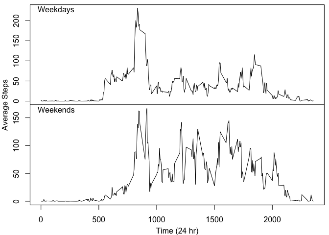

In this project, we will investigate the activity levels of a particular individual as measured by the number of steps recorded on a pedometer.  The data provided include the date of the measurement, the five-minute time interval over which the measurement was taken (for example, interval 800 would correspond to the interval beginning at 8:00 am and interval 1325 would be the five-minute interval starting at 1:25 pm), and the number of steps recorded during the time interval.

## Loading and preprocessing the data

The data are provided in a .csv file.  We load the data into a variable (FullData) and convert the dates (which are initially read as strings) to type POSIXct.  The reformatted dates are added as an additional column in the data frame.  The data frame FullData is also stored in the global environment to prevent having to re-load the data on subsequent runs of the code.  


```r
suppressMessages(library(dplyr))
if (!exists("FullData",envir=.GlobalEnv)){
     if(!file.exists("./activity.csv")){
          unzip("./activity.zip")
     }
     FullData <- as_tibble(read.csv("activity.csv",stringsAsFactors=FALSE))
     assign("FullData",FullData,envir=.GlobalEnv)
}

FullData <- tibble(FullData,PosDate=as.POSIXct(FullData$date,format="%Y-%m-%d"))
```

## What is the mean total number of steps taken per day?

To find the total number of steps taken by the individual on each day, we group together all observations according to the date, then sum the steps over each group.  To visualize this data, we create a histogram showing the distribution of the daily step counts.  At this point in the analysis, there are many missing values for the step count.  For now, we ignore the missing values, but we will attempt to deal with them later on.


```r
suppressMessages(DaySums <- FullData %>% group_by(PosDate) %>% summarize(TotalSteps=sum(steps,na.rm=TRUE)))
hist(DaySums$TotalSteps,breaks=15,density=20,xlab="Daily Steps",main="Distribution of Daily Step Totals")
```

<!-- -->

```r
mean(DaySums$TotalSteps)
```

```
## [1] 9354.23
```

```r
median(DaySums$TotalSteps)
```

```
## [1] 10395
```

As can be seen above, the mean number of steps taken each day is 9,354.23, while the median is 10,395 steps.  From the histogram, it appears that this individual puts some effort into getting that 10,000-step goal.

## What is the average daily activity pattern?

To give a picture of the daily activity of this individual, we group the step measurements together by time interval, then find the mean step count for each five minute interval.  The graph below shows how this average changes over the course of a day.


```r
suppressMessages(MinMeans <- FullData %>% group_by(interval) %>% summarize(mean=mean(steps,na.rm=TRUE)))
with(MinMeans,plot(interval,mean,type="l",ylab="Mean Steps per 5 min Interval",
                   xlab="Time (24hr)",main="Activity Level"))
```

<!-- -->

```r
MinMeans$interval[which.max(MinMeans$mean)]
```

```
## [1] 835
```

As you ca see, the maximum average step count occurs in the time interval from 8:35 to 8:40 am.

## Imputing missing values

As mentioned previously, there are many missing values in our data set.  In order to fill in those values and give a more complete picture of the activity, we isolate the missing values from the full data set and match them by time interval with the average step counts computed above.  These average values are then used as replacements for the missing data entries. Below is an updated version of the histogram presented above, this time with the complete data set.


```r
IC <- !complete.cases(FullData)
sum(IC)
```

```
## [1] 2304
```

```r
CompData <- FullData
CompData$steps[IC] <- MinMeans$mean[match(FullData$interval[IC],MinMeans$interval)]
suppressMessages(CompDaySums <- CompData %>% group_by(PosDate) %>% summarize(TotalSteps=sum(steps,na.rm=TRUE)))
hist(CompDaySums$TotalSteps,breaks=15,density=20,xlab="Daily Steps",
     main="Distribution with Imputed Daily Step Totals")
```

<!-- -->

```r
mean(CompDaySums$TotalSteps)
```

```
## [1] 10766.19
```

```r
median(CompDaySums$TotalSteps)
```

```
## [1] 10766.19
```

The step count distribution becomes a little more symmetric, and the bar that starts at 10,000 steps gets a bit taller.  Notice also that the mean an median have both increased to 10,766.19 steps.

## Are there differences in activity patterns between weekdays and weekends?

To compare weekdays and weekends, we first create a factor variable to label the different types of day an add this column to the completed data set described above.  We then group the data by both time interval and whether the day is a weekday or a weekend and calculate the mean number of steps for each combination of these two variables.  Separating the resulting data by day type and plotting the averages as a function of time gives the following plots.


```r
D <- factor(1*(weekdays(CompData$PosDate) %in% c("Saturday","Sunday")),labels=c("weekday","weekend"))
CompData <- tibble(CompData,DayType=D)
suppressMessages(WeekMinMeans <- CompData %>% group_by(interval,DayType) %>% summarize(mean=mean(steps)))
par(mfrow=c(2,1),mar=c(0,0,0,0),oma=c(3.2,3.2,0.5,0.5))
with(filter(WeekMinMeans,DayType == "weekday"),plot(interval,mean,type="l",xaxt="n"))
mtext("Weekdays", side = 3, line = -1, adj = 0.03)
with(filter(WeekMinMeans,DayType == "weekend"),plot(interval,mean,type="l"))
mtext("Weekends", side = 3, line = -1, adj = 0.03)
mtext("Time (24 hr)", side = 1, outer = TRUE,line=2.2) 
mtext("Average Steps", side = 2, outer = TRUE,line=2.2)
```

<!-- -->

It would appear that this individual tends to be much more active on weekends.  Looking at the spikes in activity, it might also be reasonable to assume that the person does some sort of exercise or other activity every morning.
